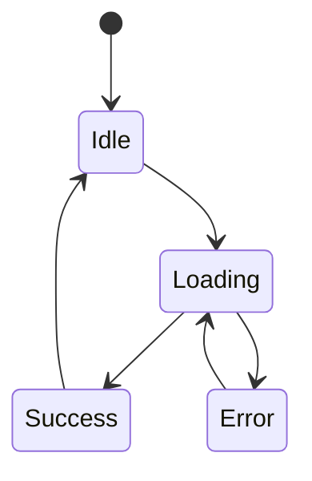

# DevDoc: <产品/功能名称>

## 1. 技术目标

<说明这版要实现什么能力，面向什么平台，哪些能力暂不实现。>

## 2. 技术假设

- 前端：<框架/平台>
- 后端：<框架/服务>
- 数据库：<数据库或本地存储>
- AI/第三方服务：<模型、API、支付、登录等>
- 部署：<Vercel、Cloudflare、服务器、本地等>

## 3. 模块划分

| 模块 | 职责 | 输入 | 输出 |
| --- | --- | --- | --- |
| <module> | <职责> | <输入> | <输出> |

## 4. 页面/路由

| 路由 | 页面 | 说明 | 权限 |
| --- | --- | --- | --- |
| `/` | <首页> | <说明> | <公开/登录> |

## 5. 数据模型

```ts
type Example = {
  id: string;
  createdAt: string;
  updatedAt: string;
};
```

## 6. API / 函数契约

### <接口或函数名称>

- 方法：`POST`
- 路径：`/api/example`
- 请求：

```json
{
  "input": "string"
}
```

- 响应：

```json
{
  "id": "string",
  "result": "string"
}
```

- 错误：
  - `400`: 输入缺失或格式错误
  - `401`: 未登录
  - `500`: 服务内部错误

## 7. 状态流转



## 8. 边界情况

- 输入为空
- 输入过长
- 网络失败
- 第三方服务超时
- 用户重复提交
- 数据保存失败
- 移动端窄屏显示

## 9. 安全与隐私

- 不在前端暴露密钥。
- 敏感字段不写入日志。
- 用户生成内容需要明确保存策略。
- 如果使用 AI API，需要说明输入数据是否会发往第三方。

## 10. 测试计划

- 单元测试：<核心函数>
- 集成测试：<API 和数据流>
- 端到端测试：<主流程>
- 手动测试：<移动端、异常、空状态>

## 11. 上线计划

1. 本地完成 P0 主流程。
2. 部署预览环境。
3. 找 3-5 位目标用户试用。
4. 修复阻塞问题。
5. 小范围公开发布。

## 12. 待确认

- <技术选型问题>
- <成本问题>
- <性能问题>
