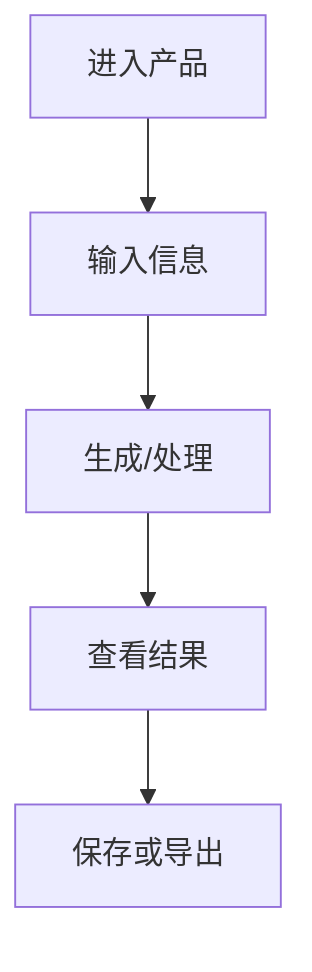

# PRD: <产品/功能名称>

## 1. 文档信息

- 作者：<姓名>
- 日期：<YYYY-MM-DD>
- 版本：v0.1
- 状态：Draft

## 2. 背景与目标

<说明业务背景、用户问题、为什么现在做。>

## 3. 用户与场景

| 用户类型 | 场景 | 当前方案 | 痛点 | 期望结果 |
| --- | --- | --- | --- | --- |
| <用户> | <场景> | <替代方案> | <问题> | <结果> |

## 4. 需求范围

### P0

- <必须实现>

### P1

- <重要但可延后>

### P2

- <锦上添花>

### 不做

- <明确排除>

## 5. 用户流程

## 6. 功能说明

### 6.1 <功能名称>

- 入口：<从哪里进入>
- 用户操作：<用户做什么>
- 系统反馈：<系统显示什么>
- 失败处理：<异常如何处理>
- 验收标准：
  - <标准 1>
  - <标准 2>

## 7. 交互与文案

- 关键按钮：<按钮文案>
- 空状态：<展示内容>
- 错误提示：<提示内容>
- 成功提示：<提示内容>

## 8. 数据需求

| 字段 | 类型 | 必填 | 说明 |
| --- | --- | --- | --- |
| <field> | <string> | 是 | <说明> |

## 9. 埋点与指标

| 事件 | 触发时机 | 属性 | 用途 |
| --- | --- | --- | --- |
| <event_name> | <时机> | <属性> | <分析目的> |

## 10. 依赖与约束

- 技术依赖：<说明>
- 设计依赖：<说明>
- 内容依赖：<说明>
- 法务/隐私依赖：<说明>

## 11. 验收清单

- [ ] P0 功能可完成主流程
- [ ] 空状态、加载状态、错误状态完整
- [ ] 关键数据可保存或导出
- [ ] 核心指标可观测
- [ ] 主要边界情况已处理
